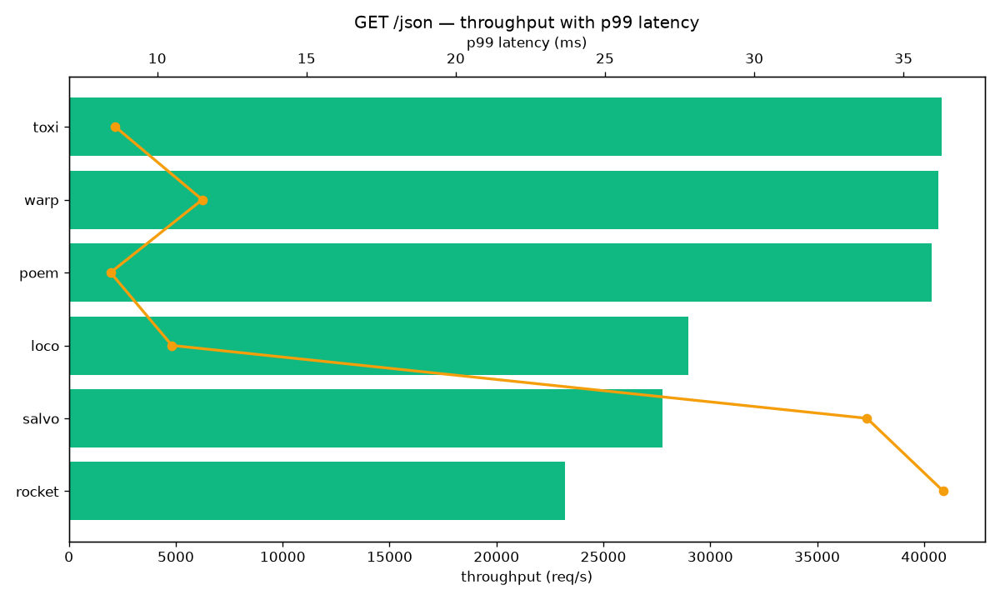
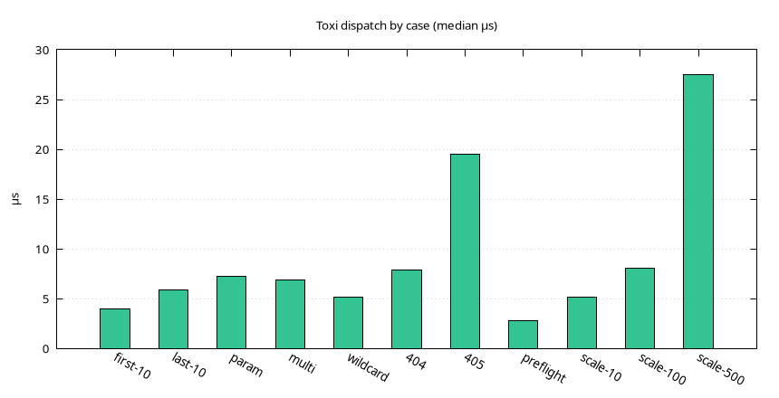

# toxi-benchmark

Benchmarks for the Toxi web framework: six-framework HTTP comparisons,
divan microbenchmark results, and the HTTP Arena entry.

## Layout

- `servers/` — HTTP comparison servers with identical routes (Toxi,
  Rocket, Loco, Poem, Salvo, Warp) plus the Loco config.
- `bench.sh` — full matrix runner: build, serve, warmup, measure,
  per-framework CSV records.
- `benchmark_runner.py` — JSON shootout runner with chart output.
- `results/` — measured tables with graphs by area.
- `frameworks/toxi/` — HTTP Arena entry (bench branch).

## Running

```bash
./bench.sh
python3 benchmark_runner.py --conns 125 --duration 30s
```

## Results

GET /json, oha 30 s, 125 connections, loopback, release builds.

| Framework | Req/s | p99 (ms) |
| --------- | ----: | -------: |
| toxi | 40,812 | 8.60 |
| warp | 40,681 | 11.51 |
| poem | 40,359 | 8.44 |
| loco | 28,994 | 10.49 |
| salvo | 27,759 | 33.78 |
| rocket | 23,207 | 36.34 |





Per-area tables with graphs: `results/`.

## HTTP Arena

The `bench` branch carries `frameworks/toxi/` (Alpine/musl Dockerfile,
`meta.json`, arena server) for upstream submission. Track:
[MDA2AV/HttpArena#1513](https://github.com/MDA2AV/HttpArena/pull/1513).
